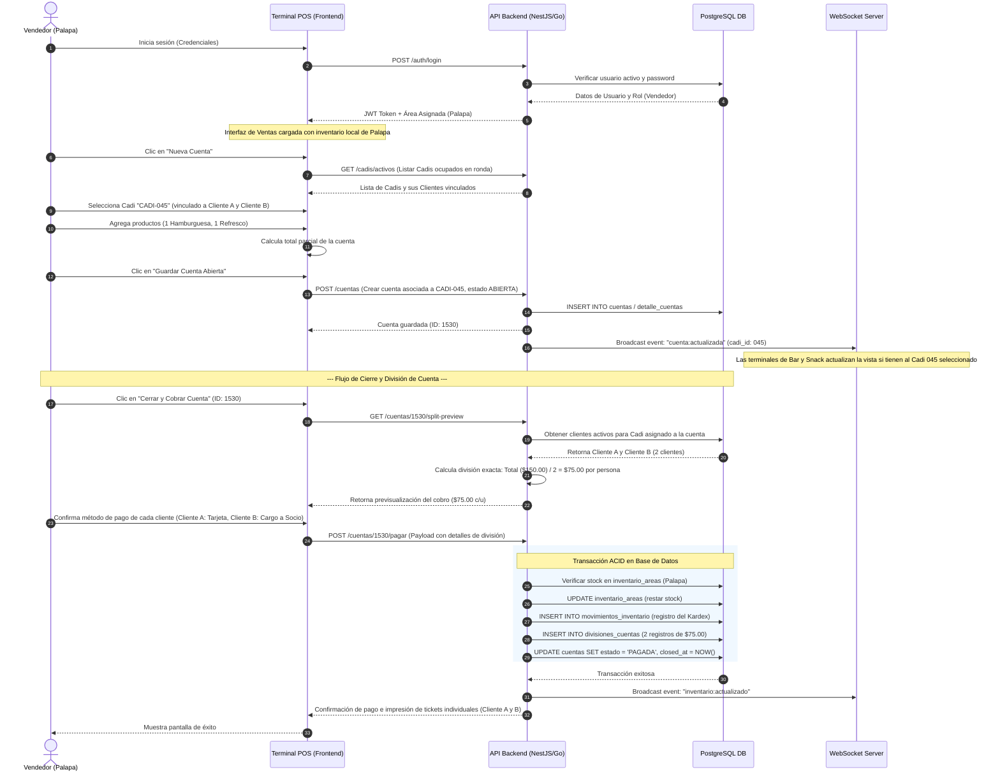

# Documento de Arquitectura y Diseño de Base de Datos - POS Campestre (Cadi System)

Este documento detalla la arquitectura de software, el diseño conceptual de base de datos (PostgreSQL DDL) y el flujo de trabajo para el sistema de punto de venta (POS) multi-sucursal/multi-área para un negocio de alimentos y bebidas con la funcionalidad de cuentas compartidas asociadas a un **Cadi**.

---

## 1. Diseño de la Base de Datos (PostgreSQL DDL)

El diseño de la base de datos utiliza restricciones de integridad referencial, índices para optimización de consultas en tiempo real y tipos de datos precisos (`NUMERIC` para montos monetarios) para evitar errores de redondeo.

```sql
-- Habilitar extensión para UUIDs si es necesario (opcional, recomendado para IDs distribuidos)
CREATE EXTENSION IF NOT EXISTS "uuid-ossp";

-- ==========================================
-- 1. GESTIÓN DE USUARIOS, ROLES Y PERMISOS (RBAC)
-- ==========================================

CREATE TABLE roles (
    id SERIAL PRIMARY KEY,
    nombre VARCHAR(50) NOT NULL UNIQUE,
    descripcion TEXT,
    created_at TIMESTAMP WITH TIME ZONE DEFAULT CURRENT_TIMESTAMP,
    updated_at TIMESTAMP WITH TIME ZONE DEFAULT CURRENT_TIMESTAMP
);

CREATE TABLE usuarios (
    id SERIAL PRIMARY KEY,
    username VARCHAR(50) NOT NULL UNIQUE,
    password_hash VARCHAR(255) NOT NULL, -- Contraseña encriptada (BCrypt/Argon2)
    nombre VARCHAR(100) NOT NULL,
    email VARCHAR(100) UNIQUE,
    activo BOOLEAN DEFAULT TRUE,
    created_at TIMESTAMP WITH TIME ZONE DEFAULT CURRENT_TIMESTAMP,
    updated_at TIMESTAMP WITH TIME ZONE DEFAULT CURRENT_TIMESTAMP
);

CREATE TABLE usuario_roles (
    usuario_id INT REFERENCES usuarios(id) ON DELETE CASCADE,
    role_id INT REFERENCES roles(id) ON DELETE CASCADE,
    PRIMARY KEY (usuario_id, role_id)
);

CREATE TABLE permisos (
    id SERIAL PRIMARY KEY,
    codigo VARCHAR(50) NOT NULL UNIQUE, -- E.g., 'pos:venta:crear', 'admin:inventario:gestionar'
    descripcion TEXT,
    created_at TIMESTAMP WITH TIME ZONE DEFAULT CURRENT_TIMESTAMP
);

CREATE TABLE rol_permisos (
    role_id INT REFERENCES roles(id) ON DELETE CASCADE,
    permiso_id INT REFERENCES permisos(id) ON DELETE CASCADE,
    PRIMARY KEY (role_id, permiso_id)
);

-- ==========================================
-- 2. ESTRUCTURA DE ÁREAS (MULTI-ENTORNO)
-- ==========================================

CREATE TABLE areas (
    id SERIAL PRIMARY KEY,
    nombre VARCHAR(50) NOT NULL UNIQUE, -- 'Bar', 'Snack', 'Palapa'
    descripcion TEXT,
    activo BOOLEAN DEFAULT TRUE,
    created_at TIMESTAMP WITH TIME ZONE DEFAULT CURRENT_TIMESTAMP
);

-- ==========================================
-- 3. PRODUCTOS E INVENTARIOS POR ÁREA
-- ==========================================

CREATE TABLE productos (
    id SERIAL PRIMARY KEY,
    codigo_barras VARCHAR(50) UNIQUE,
    nombre VARCHAR(100) NOT NULL,
    descripcion TEXT,
    precio_venta NUMERIC(12, 4) NOT NULL CHECK (precio_venta >= 0),
    categoria VARCHAR(50),
    activo BOOLEAN DEFAULT TRUE,
    created_at TIMESTAMP WITH TIME ZONE DEFAULT CURRENT_TIMESTAMP,
    updated_at TIMESTAMP WITH TIME ZONE DEFAULT CURRENT_TIMESTAMP
);

-- Inventario físico independiente por cada área
CREATE TABLE inventario_areas (
    area_id INT REFERENCES areas(id) ON DELETE RESTRICT,
    producto_id INT REFERENCES productos(id) ON DELETE RESTRICT,
    stock NUMERIC(12, 4) NOT NULL DEFAULT 0.0000, -- Decimal por si se miden por kg/litros
    stock_minimo NUMERIC(12, 4) NOT NULL DEFAULT 0.0000,
    stock_maximo NUMERIC(12, 4) NOT NULL DEFAULT 0.0000,
    ubicacion_estante VARCHAR(50),
    updated_at TIMESTAMP WITH TIME ZONE DEFAULT CURRENT_TIMESTAMP,
    PRIMARY KEY (area_id, producto_id),
    CONSTRAINT chk_stock_positivo CHECK (stock >= 0)
);

-- Historial/Kardex de movimientos de inventario (Auditoría)
CREATE TABLE movimientos_inventario (
    id BIGSERIAL PRIMARY KEY,
    area_id INT REFERENCES areas(id) ON DELETE RESTRICT,
    producto_id INT REFERENCES productos(id) ON DELETE RESTRICT,
    tipo_movimiento VARCHAR(20) NOT NULL, -- 'ENTRADA', 'SALIDA_VENTA', 'AJUSTE', 'TRANSFERENCIA'
    cantidad NUMERIC(12, 4) NOT NULL,
    stock_anterior NUMERIC(12, 4) NOT NULL,
    stock_nuevo NUMERIC(12, 4) NOT NULL,
    usuario_id INT REFERENCES usuarios(id) ON DELETE RESTRICT,
    referencia_id VARCHAR(100), -- E.g., ID de cuenta o ajuste
    motivo TEXT,
    fecha TIMESTAMP WITH TIME ZONE DEFAULT CURRENT_TIMESTAMP
);

-- ==========================================
-- 4. ENTIDADES: JUGADORES/CLIENTES Y CADIS
-- ==========================================

CREATE TABLE clientes (
    id SERIAL PRIMARY KEY,
    codigo_socio VARCHAR(50) UNIQUE, -- Código único de socio/membresía para búsqueda rápida
    nombre VARCHAR(100) NOT NULL,
    email VARCHAR(100) NOT NULL UNIQUE, -- Identificador de inicio de sesión para el portal
    password_hash VARCHAR(255) NOT NULL, -- Contraseña encriptada para el portal del cliente
    telefono VARCHAR(20),
    qr_token VARCHAR(255) UNIQUE, -- Token seguro (UUID) para generación de QR de membresía dinámico
    activo BOOLEAN DEFAULT TRUE,
    created_at TIMESTAMP WITH TIME ZONE DEFAULT CURRENT_TIMESTAMP,
    updated_at TIMESTAMP WITH TIME ZONE DEFAULT CURRENT_TIMESTAMP
);

CREATE TABLE cadis (
    id SERIAL PRIMARY KEY,
    numero_cadi VARCHAR(20) NOT NULL UNIQUE, -- E.g., 'CADI-045'
    nombre VARCHAR(100) NOT NULL,
    telefono VARCHAR(20),
    estado VARCHAR(20) DEFAULT 'DISPONIBLE', -- 'DISPONIBLE', 'EN_RONDA', 'INACTIVO'
    created_at TIMESTAMP WITH TIME ZONE DEFAULT CURRENT_TIMESTAMP,
    updated_at TIMESTAMP WITH TIME ZONE DEFAULT CURRENT_TIMESTAMP
);

-- Relación de asignación activa (Muchos a Muchos en el tiempo)
-- Un cadi puede estar asignado a varios clientes simultáneamente durante una jornada/ronda
CREATE TABLE asignaciones_cadi_clientes (
    id SERIAL PRIMARY KEY,
    cadi_id INT REFERENCES cadis(id) ON DELETE RESTRICT,
    cliente_id INT REFERENCES clientes(id) ON DELETE RESTRICT,
    fecha_inicio TIMESTAMP WITH TIME ZONE NOT NULL DEFAULT CURRENT_TIMESTAMP,
    fecha_fin TIMESTAMP WITH TIME ZONE,
    activa BOOLEAN DEFAULT TRUE,
    created_at TIMESTAMP WITH TIME ZONE DEFAULT CURRENT_TIMESTAMP,
    -- Restricción para evitar duplicar la misma asignación activa
    CONSTRAINT uq_asignacion_activa UNIQUE (cadi_id, cliente_id, activa)
);

-- ==========================================
-- 5. TRANSACCIONAL: CUENTAS Y VENTAS
-- ==========================================

CREATE TABLE cuentas (
    id BIGSERIAL PRIMARY KEY,
    area_id INT REFERENCES areas(id) ON DELETE RESTRICT,
    usuario_id INT REFERENCES usuarios(id) ON DELETE RESTRICT, -- Vendedor que la abrió
    cadi_id INT REFERENCES cadis(id) ON DELETE SET NULL,     -- Opcional
    nombre_referencia VARCHAR(100),                            -- E.g., "Mesa 4", "Hoyo 9"
    estado VARCHAR(20) NOT NULL DEFAULT 'ABIERTA',             -- 'ABIERTA', 'PAGADA', 'CANCELADA'
    subtotal NUMERIC(12, 4) NOT NULL DEFAULT 0.0000,
    impuestos NUMERIC(12, 4) NOT NULL DEFAULT 0.0000,
    descuento NUMERIC(12, 4) NOT NULL DEFAULT 0.0000,
    total NUMERIC(12, 4) NOT NULL DEFAULT 0.0000,
    created_at TIMESTAMP WITH TIME ZONE DEFAULT CURRENT_TIMESTAMP,
    closed_at TIMESTAMP WITH TIME ZONE,
    CONSTRAINT chk_totales_no_negativos CHECK (subtotal >= 0 AND total >= 0)
);

CREATE TABLE detalle_cuentas (
    id BIGSERIAL PRIMARY KEY,
    cuenta_id BIGINT REFERENCES cuentas(id) ON DELETE CASCADE,
    producto_id INT REFERENCES productos(id) ON DELETE RESTRICT,
    cantidad NUMERIC(12, 4) NOT NULL CHECK (cantidad > 0),
    precio_unitario NUMERIC(12, 4) NOT NULL CHECK (precio_unitario >= 0),
    descuento NUMERIC(12, 4) NOT NULL DEFAULT 0.0000,
    subtotal NUMERIC(12, 4) NOT NULL, -- cantidad * precio_unitario - descuento
    impuestos NUMERIC(12, 4) NOT NULL DEFAULT 0.0000,
    total NUMERIC(12, 4) NOT NULL,
    estado_item VARCHAR(20) DEFAULT 'PEDIDO', -- 'PEDIDO', 'PREPARADO', 'ENTREGADO', 'CANCELADO'
    created_at TIMESTAMP WITH TIME ZONE DEFAULT CURRENT_TIMESTAMP
);

-- Registro formal del cobro y su división
CREATE TABLE divisiones_cuentas (
    id BIGSERIAL PRIMARY KEY,
    cuenta_id BIGINT REFERENCES cuentas(id) ON DELETE RESTRICT,
    cliente_id INT REFERENCES clientes(id) ON DELETE RESTRICT,
    porcentaje_participacion NUMERIC(5, 2) NOT NULL, -- E.g., 33.33 % o 50.00 %
    monto_proporcional NUMERIC(12, 4) NOT NULL,     -- Monto exacto asignado
    metodo_pago VARCHAR(50),                         -- 'EFECTIVO', 'TARJETA', 'CARGO_HABITACION', 'CARGO_SOCIO'
    estado_pago VARCHAR(20) DEFAULT 'PENDIENTE',     -- 'PENDIENTE', 'PAGADO', 'REBOTADO'
    pagado_at TIMESTAMP WITH TIME ZONE,
    CONSTRAINT chk_porcentaje_valido CHECK (porcentaje_participacion > 0 AND porcentaje_participacion <= 100),
    CONSTRAINT uq_cuenta_cliente_division UNIQUE (cuenta_id, cliente_id)
);

-- ==========================================
-- 6. ÍNDICES DE RENDIMIENTO (TIEMPO REAL)
-- ==========================================
CREATE INDEX idx_cuentas_estado ON cuentas(estado) WHERE estado = 'ABIERTA';
CREATE INDEX idx_inventario_stock ON inventario_areas(area_id, stock);
CREATE INDEX idx_asignaciones_activas ON asignaciones_cadi_clientes(cadi_id) WHERE activa = TRUE;
CREATE INDEX idx_detalle_cuenta_id ON detalle_cuentas(cuenta_id);
```

### Explicación de las Restricciones y Estructuras Clave
1. **`inventario_areas` (Clave Compuesta y Check de Stock):** Define de forma clara que cada producto tiene un stock aislado por área. La restricción `chk_stock_positivo` asegura que el motor de la base de datos lance una excepción inmediata si una transacción intenta descontar más de lo que existe físicamente (previniendo inventarios negativos accidentales en concurrencia).
2. **`asignaciones_cadi_clientes`:** La clave única `uq_asignacion_activa` (compuesta por `cadi_id`, `cliente_id` y `activa`) permite que un Cadi esté asignado a múltiples clientes al mismo tiempo (ej. 3 clientes en el mismo grupo de juego), pero impide registrar al mismo cliente con el mismo cadi de forma redundante mientras la asignación esté activa.
3. **`divisiones_cuentas`:** Almacena la liquidación final de la cuenta. Permite calcular tanto divisiones equitativas como personalizadas, manteniendo la trazabilidad histórica de cuánto pagó cada cliente por una sola cuenta unificada.

---

## 2. Arquitectura Tecnológica Recomendada

Para garantizar **baja latencia**, **cálculos matemáticos con precisión de centavos** y **actualizaciones en tiempo real** en las 3 terminales físicas (Bar, Snack, Palapa), se propone la siguiente arquitectura:

```mermaid
graph TD
    subgraph Capa de Cliente (POS Terminals)
        A1[Terminal Bar - React SPA]
        A2[Terminal Snack - React SPA]
        A3[Terminal Palapa - React SPA]
    end

    subgraph Capa de Red e Ingreso
        B[Nginx / API Gateway]
    end

    subgraph Capa de Servidor (Backend Services)
        C[NestJS / Go API Service]
        D[Socket.io / WebSockets Engine]
    end

    subgraph Capa de Caché y Mensajería
        E[(Redis Cache & Pub/Sub)]
    end

    subgraph Capa de Persistencia
        F[(PostgreSQL Primary DB)]
    end

    A1 <-->|HTTPS / WebSockets| B
    A2 <-->|HTTPS / WebSockets| B
    A3 <-->|HTTPS / WebSockets| B
    B <--> C
    B <--> D
    C <--> E
    D <--> E
    C <--> F
```

### Stack Tecnológico Detallado

| Capa | Tecnología Seleccionada | Justificación Técnica |
| :--- | :--- | :--- |
| **Frontend** | **React (Vite) + TypeScript + Zustand** | React con Vite ofrece una velocidad de carga inicial insuperable y un renderizado ultrarrápido para pantallas de POS táctiles. Zustand es un gestor de estado ligero ideal para manejar el carrito de compras local y las actualizaciones de inventario en tiempo real sin la sobrecarga de Redux. |
| **Backend** | **NestJS (TypeScript)** o **Go (Golang)** | **NestJS** ofrece una arquitectura robusta basada en módulos y excelente soporte nativo para WebSockets/Microservicios. **Go** es una alternativa excelente si el volumen de concurrencia es extremo. Ambos aseguran tiempos de respuesta < 50ms para transacciones críticas. |
| **Bases de Datos** | **PostgreSQL 15+** | Relacional ACID para asegurar transacciones financieras. El uso del tipo de dato `NUMERIC` garantiza que los cálculos de división de cuentas no tengan errores de redondeo IEEE 754 (común si se usan floats). |
| **Mensajería / Caché**| **Redis** | Actúa como capa de caché para el catálogo de productos y como motor de Pub/Sub para propagar cambios de stock y el estado de las cuentas compartidas en tiempo real hacia todas las terminales conectadas. |
| **Tiempo Real** | **WebSockets (Socket.io)** | Permite que si el Bar añade un producto a una cuenta compartida por un Cadi, el resto de las áreas visualice inmediatamente el cambio en el total de la cuenta. |

### Lógica de Precisión Numérica (Evitando errores de coma flotante)
* **Regla de Oro:** Nunca usar tipos `float` o `double` para variables que involucren dinero.
* **En Base de Datos:** Se define `NUMERIC(12, 4)` que almacena números decimales fijos exactos de 4 decimales.
* **En el Backend (TypeScript):** Utilizar la biblioteca `decimal.js` o `big.js` para realizar las operaciones aritméticas de división:
  $$\text{monto\_cliente} = \text{Decimal}(\text{total\_cuenta}).\text{div}(\text{cantidad\_clientes})$$
* **Manejo de Residuos Financieros:** En divisiones no exactas (ej. \$100.00 entre 3 clientes = \$33.3333...), el sistema debe aplicar un ajuste al último cliente (el "residuo"):
  - Cliente 1: \$33.33
  - Cliente 2: \$33.33
  - Cliente 3: \$33.34 (Ajuste del residuo de \$0.02)

---

## 3. Flujo de Trabajo (Paso a Paso del Vendedor)

A continuación se detalla el flujo interactivo de un vendedor en una terminal del POS:



### Detalles Técnicos del Flujo de División

1. **Selección del Cadi:** Al abrir la cuenta en la Palapa, el sistema consulta en tiempo real qué Cadis tienen asignaciones activas (`activa = true`) en la tabla `asignaciones_cadi_clientes`. Si el Cadi tiene 3 clientes registrados en su grupo de juego, el POS muestra un indicador visual: *"Cadi 045 asignado a: Juan Pérez, Luis Gómez, Ana Ruiz"*.
2. **Registro de Consumo Dinámico:** Se pueden agregar consumos en cualquier momento. El inventario **no se descuenta** sino hasta que se realiza la preparación o entrega del producto (según configuración del sistema) o al momento del pago final, a través de una transacción de base de datos que descuenta de la tabla `inventario_areas` filtrando por el `area_id` de la cuenta actual (ej. Palapa).
3. **Cálculo de la División al Cierre:**
   - Si la cuenta tiene un Cadi asociado, el backend consulta cuántos clientes están vinculados activamente a ese cadi en ese preciso instante.
   - Si no hay un Cadi, la cuenta se cobra de forma normal a un solo cliente genérico o de manera manual.
   - Si hay un Cadi y se detectan 3 clientes asociados, el backend calcula el total y divide de forma exacta.
   - El sistema genera los registros correspondientes en `divisiones_cuentas` vinculando a cada cliente con su monto exacto. Esto permite flexibilidad: si un cliente desea pagar en efectivo y otro con cargo a su tarjeta de socio del club, el sistema procesa cada pago de forma individual bajo la misma cuenta madre.

---

## 4. Acceso Web y Despliegue en la Nube (SaaS / Acceso por URL)

Para permitir el acceso seguro por internet para superusuarios (administradores) y vendedores desde cualquier dispositivo, se propone el siguiente flujo de despliegue y topología de red:

```mermaid
graph TD
    subgraph Internet Pública
        U[Usuario / Terminal POS] -->|HTTPS: pos.campestre.com| CDN[Cloudflare CDN / WAF]
    end

    subgraph Nube (VPC / Entorno Seguro)
        CDN -->|Reenvío seguro| ALB[Application Load Balancer]
        ALB -->|API Requests| API[API Backend NestJS / Go]
        ALB -->|Static Files fallback| S3[Storage S3 / Frontend Assets]
        
        API -->|Cache / Sesiones| Redis[(Redis Cluster)]
        API -->|Transacciones ACID| DB[(PostgreSQL Cloud Managed)]
    end
```

### Topología y Modelo de Infraestructura

1.  **Frontend (POS Web Client):**
    *   **Despliegue:** Compilado optimizado del SPA de React en plataformas CDN como **Vercel**, **Netlify** o **Cloudflare Pages**.
    *   **Ventaja:** Tiempos de carga casi instantáneos (bajo latencia de red) en cualquier navegador moderno mediante caché perimetral en todo el mundo.
2.  **Backend (API Server):**
    *   **Despliegue:** Contenedores Docker corriendo en servicios administrados como **AWS ECS (Fargate)**, **Google Cloud Run** o un VPS como **DigitalOcean App Platform**.
    *   **Capa de Acceso:** Un Balanceador de Carga (ALB) expone los puertos seguros y enruta el tráfico HTTP/WebSockets al clúster backend.
3.  **Base de Datos Relacional y Caché:**
    *   **PostgreSQL Administrado:** Base de datos gestionada (ej. AWS RDS o Supabase) con almacenamiento SSD NVMe y escalado automático de lectura para soportar altas cargas.
    *   **Redis Managed Cluster:** Usado para almacenar el estado de las conexiones activas por WebSocket y caché de sesión, garantizando lecturas ultra rápidas.

---

## 5. Seguridad y Autenticación en Internet (Protección de Credenciales)

Acceder a una aplicación financiera y transaccional desde internet requiere controles estrictos de seguridad para prevenir accesos no autorizados y robos de sesión:

```
[Cliente POS (Navegador)] <============= Canal HTTPS (TLS 1.3) =============> [API Backend]
       |                                                                            |
       |----- (1) POST /api/auth/login (Credenciales cifradas) -------------------->| Encriptación BCrypt
       |                                                                            | Comprobación RBAC
       |<---- (2) Set-Cookie: token_jwt; HttpOnly; Secure; SameSite=Strict --------| Generación JWT
       |                                                                            |
       |----- (3) GET /api/cuentas (Cookie adjuntada automáticamente) ------------->| Valida Firma JWT
       |                                                                            | Valida Rol / Permisos
```

### Mecanismos de Seguridad Implementados

*   **Cifrado en Tránsito (TLS 1.3):** Conexión HTTPS obligatoria en todo el sitio mediante certificados SSL automatizados por Let's Encrypt o Cloudflare. HSTS habilitado para denegar conexiones HTTP desprotegidas.
*   **Seguridad de Credenciales (Hash y Salt):** Las contraseñas se almacenan en la base de datos aplicando algoritmos de hash criptográfico unidireccional con sal dinámica usando **Argon2id** o **BCrypt (mínimo costo 12)**.
*   **Manejo de Sesiones mediante JWT Seguros:**
    *   Al autenticarse, el backend genera un JSON Web Token (JWT) firmado con una clave secreta fuerte (rotada periódicamente).
    *   El token **no** se almacena en `localStorage` o `sessionStorage` (que son vulnerables a ataques XSS). Se envía en una cookie con las propiedades:
        *   `HttpOnly`: Impide el acceso al token mediante scripts de JavaScript.
        *   `Secure`: Asegura que la cookie solo viaje en canales HTTPS.
        *   `SameSite=Strict` o `Lax`: Previene ataques CSRF (Cross-Site Request Forgery).
*   **Rate Limiting y Prevención de Fuerza Bruta:**
    *   Se aplica un límite de peticiones (ej. máximo 5 intentos de inicio de sesión por minuto por usuario/IP) usando Redis en el backend.
    *   Bloqueo temporal de cuentas tras múltiples intentos fallidos.
*   **Middleware de Autorización RBAC:**
    *   Cada petición API y conexión WebSocket verifica la firma del token y comprueba si el rol del usuario cuenta con los permisos necesarios en `rol_permisos`.
    *   Un vendedor no puede consumir endpoints de administración de inventarios generales o creación de usuarios bajo ninguna circunstancia.

---

## 6. Tolerancia a Fallas de Conectividad (Offline Resilience - PWA)

En entornos de clubes campestres y campos de golf, es habitual que zonas como la **Palapa** o las áreas alejadas experimenten caídas temporales de la conexión a internet. Un POS no puede dejar de operar por fallas de señal.

### Estrategia de Conectividad Offline-First

1.  **PWA (Progressive Web App):**
    *   El frontend incluye un **Service Worker** que descarga y almacena en caché local del navegador todos los recursos necesarios para que la aplicación cargue y funcione sin conexión.
2.  **Base de Datos Local (IndexedDB con RxDB o PouchDB):**
    *   Cuando la app detecta que está sin conexión, las ventas y cuentas abiertas se guardan localmente en la base de datos IndexedDB del navegador.
    *   El stock del inventario local de la terminal se descuenta provisionalmente en memoria y en la base local del POS.
3.  **Algoritmo de Sincronización Idempotente:**
    *   Toda transacción sin conexión genera un **UUID v4 único** (`transaccion_uuid`) como identificador principal.
    *   Cuando el navegador detecta que se ha restablecido la red, encola y procesa en segundo plano las peticiones guardadas localmente.
    *   El backend utiliza el `transaccion_uuid` para asegurar idempotencia: si una transacción ya fue procesada pero la respuesta de red se perdió, el backend no duplicará la transacción, simplemente retornará la confirmación existente.
4.  **Flujo Visual de Red:**
    *   La terminal del vendedor muestra un indicador semafórico de conectividad:
        *   🟢 **Online:** Conectado directamente a la nube. Sincronización en tiempo real vía WebSockets activa.
        *   🟡 **Reconnecting:** Reintentando conexión. Cola de mensajes offline procesándose.
        *   🔴 **Offline:** Operación local habilitada. El POS almacena los cambios localmente de forma segura.

---

## 7. Portal del Cliente (Socios) y Flujo de Selección por Código QR

Para empoderar a los clientes, permitirles auditar sus propios consumos y facilitar el trabajo de los vendedores en el punto de venta, el sistema incorpora un **Portal de Clientes/Socios** integrado:

```
                  +----------------------------------------------+
                  |           Portal del Socio (Móvil)          |
                  |                                              |
                  |  [ Registro / Login ] -> Crea Contraseña     |
                  |                                              |
                  |  [ Ver mis consumos ]    [ Código QR Dinámico]|
                  |  - Hamburguesa: $100.00  +------------------+
                  |  - Refresco: $50.00      |                  |
                  |                          |     :: QR ::     |
                  |  Total: $150.00 (split)  |                  |
                  |                          +------------------+
                  +----------------------------------------------+
                                          |
                                    (Escaneo en POS)
                                          v
                  +----------------------------------------------+
                  |                 Punto de Venta               |
                  |                                              |
                  |  El vendedor escanea el QR o busca por ID    |
                  |  -> El cliente se asocia automáticamente     |
                  +----------------------------------------------+
```

### Funcionalidades del Portal del Socio (`https://socios.campestre.com`)

1.  **Auto-Registro y Gestión de Credenciales:**
    *   Cualquier socio del club puede registrarse ingresando su número de membresía (`codigo_socio`), nombre, correo electrónico y estableciendo una contraseña segura.
    *   El backend valida que el `codigo_socio` exista en la lista autorizada del club antes de permitir el registro.
2.  **Consulta de Gastos e Historial en Tiempo Real:**
    *   Una vez iniciada la sesión, el cliente accede a un panel con su historial de gastos detallado.
    *   **Transparencia de Cuentas Divididas:** Si el cliente formó parte de una cuenta compartida administrada por un Cadi, el portal le muestra el desglose:
        *   El consumo general del grupo.
        *   Los participantes de la división.
        *   Su porcentaje asignado y el total exacto cobrado a su cuenta individual.
3.  **Código QR de Membresía Dinámico:**
    *   El portal genera un código QR que contiene el token seguro del socio (`qr_token`).
    *   Para evitar capturas de pantalla viejas o robo de identidad de membresías, este token se puede regenerar dinámicamente con una expiración (TOTP o tokens de corta duración) similar a un código de autenticación de doble factor, o bien mediante un WebSocket que actualiza el QR cada 60 segundos.

### Flujo Simplificado para el Vendedor (Asociación Rápida)

Para que el vendedor no pierda tiempo digitando datos en la tablet mientras toma un pedido en el Bar o la Palapa, se implementa el siguiente flujo de selección:

1.  **Apertura de Cuenta:** El vendedor abre una nueva cuenta en la Palapa.
2.  **Identificación del Cliente (2 métodos):**
    *   **Escaneo de QR:** El vendedor pulsa el botón "Escanear Socio" en la pantalla de la tablet del POS. La cámara frontal/trasera se activa brevemente, el socio presenta su código QR desde su celular y el POS descodifica el `qr_token`. El backend asocia al cliente a la cuenta abierta en una fracción de segundo.
    *   **Búsqueda Rápida:** Si el socio no tiene su teléfono, el vendedor escribe las primeras letras del nombre o del número de socio en un buscador inteligente con autocompletado en tiempo real (que consume un endpoint optimizado con índices en `codigo_socio` y `nombre`).
3.  **Registro y Sincronización:** El vendedor solo tiene que pulsar sobre el socio sugerido para asignarlo. El sistema realiza el enlace en la base de datos de manera transparente y segura.
